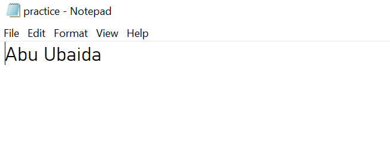

<!--This Markdown contain file-->

__F__~~i~~`l`_e_
---

### To write something in a file
<ul type="square">
<li> fputc()
<li> fputw()
<li> fputs()
<li> fprintf()
<li> fwrite()
</ul>

### To read something in a file

<ul type="square">
<li> fgetc()
<li> fgetw()
<li> fgets()
<li> fscanf()
<li> fread()
<li> !feof()
</ul>

- [x] FILE
- [x] fopen("filename.txt","w") (w-write) (r-read) (a-appending)
- [x] r (read)
- [x] w (write: start new)
- [x] a (appendeng: start with old data)
- [x] NULL
- [x] fclose(file); [FILE *file]
- [x] fputc (copy the character)
- [x] fputs (copy the string)
- [x] 
### open and close file

```c
#include<stdio.h>
int main()
{
    FILE *file;

    file = fopen("test.txt","w");

    if(file==NULL)
    {
        printf("file doesn't exist");
    }
    else
    {
        printf("file created");
        fclose(file);
    }
    getch();
}
```

<image src="./images/openclose.png" border="5" hspace="10" vspace="10" alt="file not found" align="top" title="print" height="100" width="300"/>

</br>
<image src="./images/location.png"/>

### open new file write name ,copy single word by fputc

<p> fputc c is charcter </p>

```c
#include<stdio.h>
int main()
{
    FILE *myfile;
    char name[]="Abu Ubaida";
    int length=strlen(name),i;

    myfile=fopen("practice.txt","w");

    if(myfile==NULL)
    {
        printf("file does not exist");
    }
    else
    {
        printf("file opened\n\n");
        for(i=0; i<length; i++)
        {
            fputc(name[i],myfile);
        }
        printf("file written successfully\n");
        fclose(myfile);
        getch();
    }
}
```
  </br>



### using a (appending mode)

<p style="text-align:center; color:rgb(39,135,225)" > it works, Open old file and added new text.</p>

`char name[]="\nAl Burak";`
`myfile=fopen("practice.txt","a");`

</br>
<image src="./images/appending.png">  

### using string fputs for copy full sentence

```c
#include<stdio.h>
int main()
{
    FILE *afile;
    afile=fopen("filename.txt","w");
    char a[100];
    char b[]="Ready to go";
    if(afile==NULL)
    {
        printf("file does not exist\n");
    }
    else
    {
        printf("file created\n\n");
        printf("Enter any name : ");
        gets(a);
        fputs(b,afile);
        fputs("\n",afile);
        fputs(a,afile);
        printf("file written successfully");
        fclose(afile);
    }
    getch();
}
```
<image src="./images/stringcopy.png" width="200px" height="140px" title="stringcopy" border="4" hspace="5" vspace="4" alt="scopy image not found"/>  

### fprintf

<p style="color:blue; text-align:center"> printf on documents character and digits both</p>

```c
#include<stdio.h>
int main()
{
    FILE *afile;
    afile=fopen("read.txt","w");

    char name[100];
    int age;

    if(afile==NULL)
    {
        printf("file does not exist");
    }
    else
    {
        printf("file created\n\n");
        printf("Enter name : ");
        gets(name);
        printf("Enter age : ");
        scanf("%d",&age);
        fprintf(afile,"Name : %s\nAge : %d\n",name,age);
        fclose(afile);
    }
    getch();
}
```
<image src="./images/fprintf.png" width="" height="" title="input charactar and digits both " alt="no image found" />

<image src="./images/fprintf1.png" width="200" height="100" />

</br>

`mfile=fopen("read.txt","a");`


<image src="./images/appendingmultiple1.png" />

### read a file fgetc

```c
#include<stdio.h>
int main()
{
    FILE *afile;
    afile=fopen("read.txt","r");

    char ch;

    if(afile==NULL)
    {
        printf("file does not exist");
    }
    else
    {
        printf("file created\n\n");
        while(!feof(afile))
        {
            ch = fgetc(afile);
            printf("%c",ch);
        }
        fclose(afile);
    }
    getch();
}
```

<image src="./images/read.png" align="top" border="5px" alt="image not found" hspace="5" vspace="5" title="read"/>  

### string read file

```c
#include<stdio.h>
int main()
{
    FILE *file;
    file=fopen("read.txt","r");

    char ch[100];

    if(file==NULL)
    {
        printf("file does not exist");
    }
    else
    {
        printf("file created\n\n");
        while(!feof(file))
        {
            fgets(ch,3,file);
            printf("%s",ch);
        }
        printf("file written successfully.");
        fclose(file);
    }
    getch();
}
```
<image src="./images/stringread.png" title="string read file" border="2px" />  

### fscanf() read file

```c
#include<stdio.h>
int main()
{
    FILE *file;
    file=fopen("readtext.txt","r");

    char fname[100];
    char lname[100];
    int age;

    if(file==NULL)
    {
        printf("file does not exist");
    }
    else
    {
        printf("file created\n\n");
        fscanf(file,"%s %s %d",&fname,&lname,&age);
        printf("%s %s %d",fname,lname,age);
        printf("\n\nfile read successfully.");
        fclose(file);
    }
    getch();
}
```

<image src="./images/textfrom.png">
<image src="./images/texttopreview.png">

